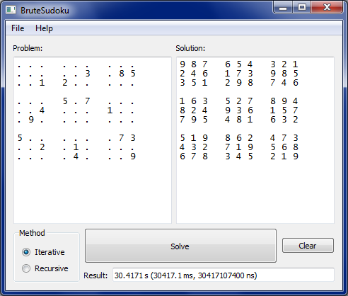

# BruteSudoku

This program solve 9x9 [sudoku](https://en.wikipedia.org/wiki/Sudoku) problem using recursive descent ([backtracking](https://en.wikipedia.org/wiki/Sudoku_solving_algorithms#Sudoku_brute_force)) with two algorithms: iterative and recursive. Candidates for each cell are chosen randomly, so for one table it can find several solutions. Start cell is chosen from the most filled row to discard as much as possible invalid candidates at the beginning of an algorithm.

The program is written in C++17 and depends on [Qt](https://www.qt.io/offline-installers) external libraries for interface and signals/slots to communicate async algorithm with main window.

## Algorithm

Input:
- table - initial table of numbers 9x9, may not be filled fully.

Output:
- same table from input, filled with numbers representing soluton if one exists.

Variables:
- candidates - map\<int, vector\<int\>\> contains vectors of potential candidates for each cell;
- stack\<int\> - stack representing recursive calls, contains coordinates of each filled cell when recursive algorithm iterates one steep deeper.

### Resursive pseudocode

```
1. Define function solveRecursive(emptyCell: int):
1.1. If there is any empty sell:
1.1.1. Modify emptyCell := linear coordinate of this cell (0..80).
1.2. Else:
1.2.1. Return True.
1.3. For each val in \[random permutation of 0..9\]:
1.3.1. If val at table\[pos\] is valid:
1.3.1.1. If solveRecursive(emptyCell):
1.3.1.1.1. Return True.
1.3.1.2. Else:
1.3.1.2.1. table\[tmpPos\] := SudokuTable::EMPTY_NUM.
1.4. Return False.
```

More details in [this file](src/Solvers/RecursiveSolver.cpp).

### Iterative pseudocode

```
1. While True:
1.1. If there is any empty sell:
1.1.1. Put emptyCell := linear coordinate of this cell (0..80)
1.2. Else:
1.2.1. Break.
1.3. Put values := candidates\[emptyCell\] - reference to candidates for 
     emptyCell (create empty vector if one doesn't exist).
1.3. Fill values with random permutation of 0..9.
1.3. Define function tryCandidates(values: reference to vector\<int\>, pos: int) returning bool:
1.3.1. While values is not empty:
1.3.1.1. Put val := values.pop().
1.3.1.2. If val at table\[pos\] is valid:
1.3.1.2.1. stas.push(pos).
1.3.1.2.1. Return True.
1.3.2. Return False.
1.4. If tryCandidates(values, emptyCell):
1.4.1. Continue.
     // At pos none of digits is allowed. Unwind stack and try change previous values.
1.5. While stack is not empty:
1.5.1. tmpPos := stas.pop().
1.5.1. tmpValues := candidates\[tmpPos\].
1.5.1. If tryCandidates(tmpValues, tmpPos):
1.5.1.1. Break.
1.5.1. Else:
1.5.1.1. table\[tmpPos\] := SudokuTable::EMPTY_NUM.
1.6. If stack is empty:
       // If initial table filled correctly there always is a solution.
1.6.1. throw std::runtime_error("No solution").
2. Return table
```

More details in [this file](src/Solvers/IterativeSolver.cpp).

## Examples



